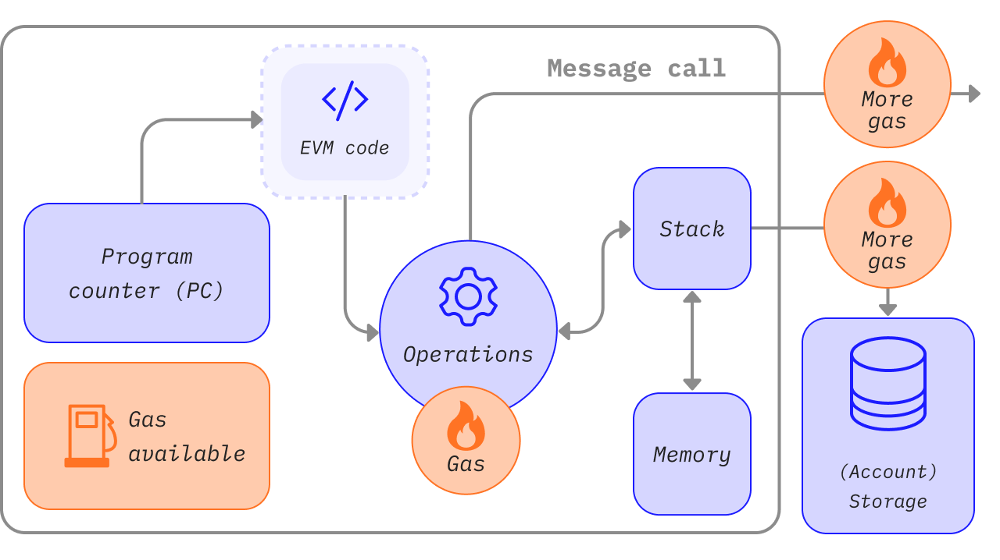
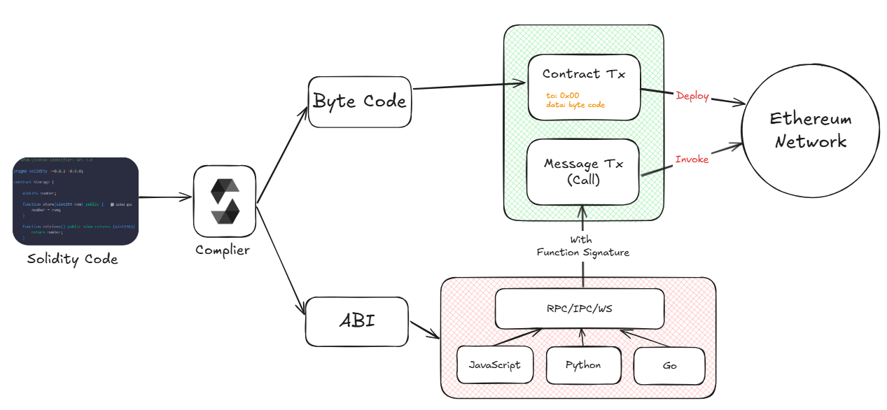
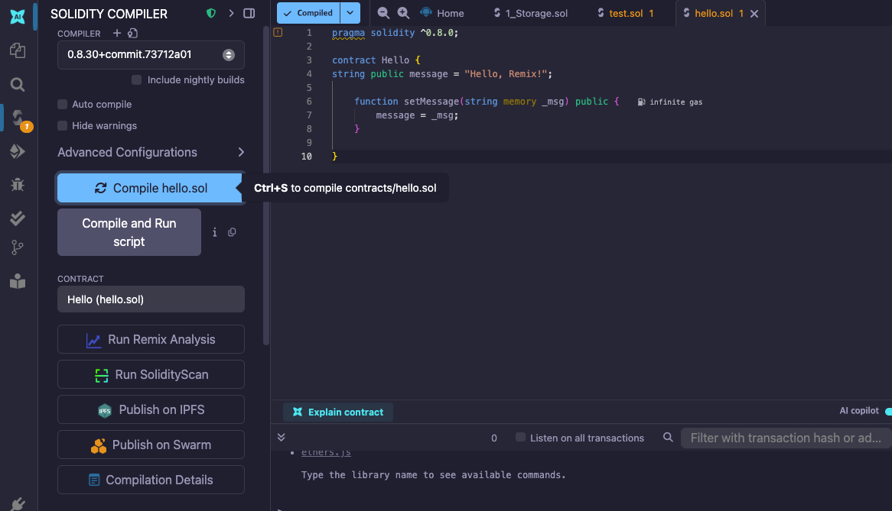
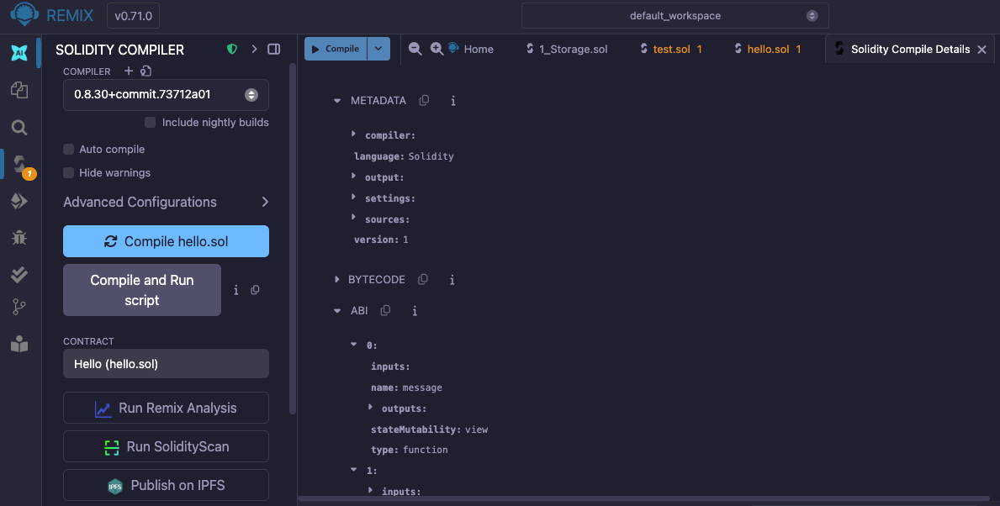
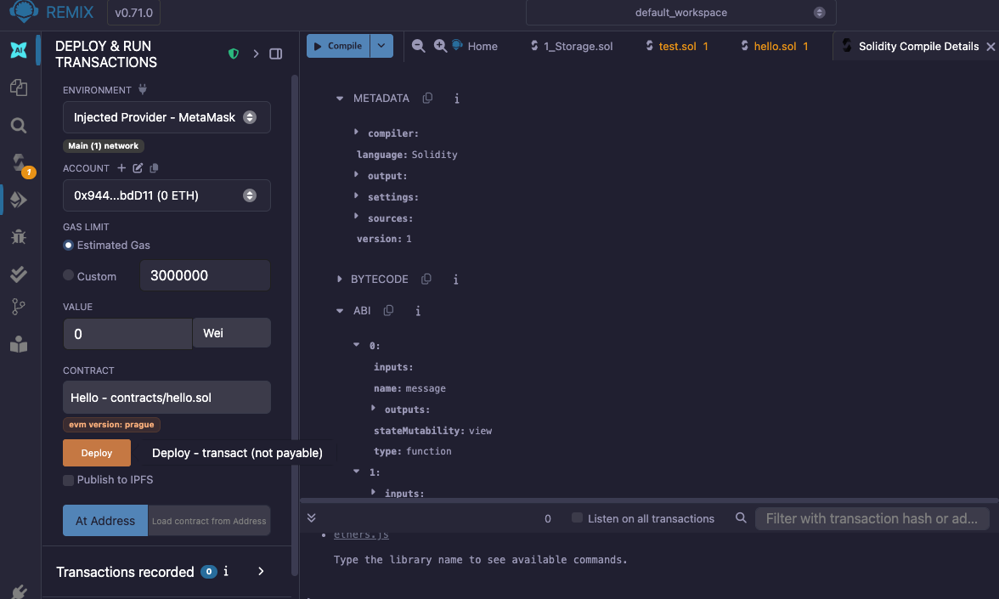
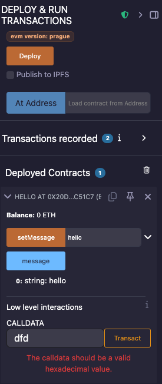

id: html
summary: Solidity를 사용하여 Smart Contract 개발에 대해 이해한다.
categories: Solidity
status: Published
feedback email: sinphi03@gmail.com
tags: Solidity, Blockchain, Smart Contracts
authors: Jiseop Shin
duration: 110

# Week 1: Smart Contract와 Solidity 익히기

<!-- ------------------------ -->

## 세션 소개

Duration: 5

이번 세션은 Solidity를 사용하여 Smart Contract 개발에 대해 이해하는 것이 목적입니다. 여러분은 단순히 문법을 배우는 것을 넘어, 이더리움 생태계의 핵심 원리를 이해하고, 스마트 컨트랙트를 작성하여 블록체인 상에 배포하는 개발 과정을 경험하게 됩니다.

### 목차

#### 1. 이더리움(Ethereum)

블록체인의 기본 원리를 바탕으로 이더리움이 어떻게 동작하는지 알아봅니다. 사용자가 상호작용하는 **계정(EOA/CA),** 모든 상태 변화를 일으키는 트랜잭션, 그리고 연산의 대가로 지불하는 **가스(Gas)의** 개념을 명확히 이해합니다.

#### 2. EVM(Ethereum Virtual Machine)

스마트 컨트랙트가 실행되는 격리된 샌드박스 환경인 EVM의 아키텍처를 살펴봅니다. EVM이 데이터를 처리하는 핵심 영역인 **스택(Stack), 메모리(Memory), 스토리지(Storage)의** 차이점을 배우고, 이것이 가스비와 프로그래밍에 어떤 영향을 미치는지 알아봅니다.

#### 3. 스마트 컨트랙트(Smart Contract)

스마트 컨트랙트의 라이프사이클, 즉 작성 → 컴파일 → 배포 → 실행에 이르는 전체 단계를 명확히 이해하고 컨트랙트의 기본 구조를 파악합니다. 또한, 결정론적 프로그램에 대해 알아 봅니다.

#### 4. Solidity

스마트 컨트랙트 작성을 위한 필수 문법을 예제 코드와 함께 학습합니다. 블록체인에 영구히 기록될 상태 변수, 컨트랙트의 기능을 정의하는 함수와 제어문, 그리고 데이터를 효율적으로 관리하는 **매핑(Mapping)과 구조체(Struct)** 사용법을 익힙니다.

#### 5. 환경 설정 및 테스트

개발을 위해 Ethereum IDE인 **리믹스(Remix IDE)와 HardHat**을 중심으로 개발 환경을 설정합니다. 가상의 테스트넷에 컨트랙트를 배포하고, 작성한 함수의 기능이 올바르게 동작하는지 테스트하고 디버깅하는 방법을 실습합니다.

#### 6. 프로젝트 준비

진행할 프로젝트의 요구사항을 정의하고 아키텍처를 소개합니다. 앞으로 구현해야할 기능과 주의해야할 점을 함께 살펴 봅니다.

<!-- ------------------------ -->

## 이더리움(Ethereum)

Duration: 15

이더리움(Ethereum)은 전 세계에 분산되어 있는 컴퓨터로, 그 분산된 구조에도 불구하고 **하나의 컴퓨터(Truly Global Singleton)처럼** 동작하며, 실패나 정지, 검열을 겪지 않습니다. 또한, 여러 명의 사용자가 동시에 참여할 수 있고, 누구나 자유롭게 접근할 수 있는 개방적인 시스템입니다.

이더리움은 원래 범용 프로그래밍 언어를 통해 블록체인 기반의 다양한 가능성을 실현하기 위해 고안되었습니다. 그 범위는 에스크로 거래, 인출 제한, 금융 계약, 갬블링 시장 등 다양합니다. **튜링 완전(Turing Complete)한** 프로그래밍 언어를 지원함으로써, 어떠한 형태의 거래나 기능도 **스마트 계약(Smart Contracts)을** 통해 자유롭게 구현할 수 있게 되었습니다. 이로써, 단순한 암호화폐를 넘어서, 복잡한 계약과 거래를 실행할 수 있는 강력한 플랫폼이 탄생하게 된 것입니다.

하지만, 이더리움이 처음 의도한 것보다 더 큰 가능성을 열게 된 사실은 그 자체가 하나의 **세계적 컴퓨터(World Computer)처럼** 동작한다는 점입니다. 이더리움의 스마트 컨트랙트는 분산화된 네트워크에서 자동으로 실행되는 프로그램으로, 중개자 없이 신뢰할 수 있는 거래를 가능하게 합니다. 이 시스템을 이해하고 스마트 컨트랙트를 개발하는 것은 이더리움의 잠재력을 최대한 활용하는 데 매우 중요한 부분입니다.

### 상태(World State)


이러리움은 트랜잭션 기반의 state machine입니다. 이더리움 상에 저장되어 있는 정보를 상태(World State)라 생각하면 됩니다. 이를 트랜잭션을 통해 계산하고 그 결과를 상태에 반영할 수 있습니다. 상태는 주소와 계좌 상태를 매핑한 형태로 표현되며, 이 상태 정보의 머클 루트도 블록 헤더에 포함됩니다. 이 루트는 Merkle Patricia Tree로 구성되며, 이 구조는 각 주소와 관련된 계좌 정보(잔액, 스마트 계약 상태 등)를 효율적으로 관리합니다. World State의 머클 루트는 블록이 생성될 때의 시스템 상태를 나타내며, 이 해시값은 블록의 유효성을 검증하는 데 사용됩니다.

### 트랜잭션(Transactions)

트랜잭션(Transaction)은 네트워크 상에서 데이터를 전송하거나 스마트 계약을 실행하는 단위입니다. 이더리움의 상태를 변경하거나 쿼리하는 작업을 포함합니다. 트랜젝션은 행위자(actor)의 서명이 된 채로 제출됩니다. 각 블록에는 여러 트랜잭션이 포함됩니다. 이 트랜잭션들은 블록 안에서 머클 트리(Merkle Tree)로 구성되고, 그 머클 루트는 블록 헤더에 저장됩니다. 머클 트리는 트랜잭션들의 해시값을 이진 트리 형태로 합쳐나가며, 트랜잭션들의 무결성을 보장하고, 효율적으로 트랜잭션을 검증할 수 있게 해줍니다.

서명 과정 설명하기

## EVM(Ethereum Virtual Machine)



#### Storage

블록체인에 영구적으로 저장되는 데이터입니다. 스토리지는 키(Key)와 값(Value) 쌍으로 이루어진 구조를 가집니다. 각 키와 값의 크기는 32byte입니다. 주로 함수 외부에 정의 된 변수, 함수와 같은 스마트 컨트랙트의 주요 정보가 저장되며 영속적입니다 따라서 가스비가 가장 비쌉니다.

#### Memory

함수나 반복문이 실행되는 동안에만 임시로 데이터를 저장합니다. 함수 실행이 끝나면 사라지며, Storage보다 훨씬 저렴합니다. 함수의 경우 함수가 실행될 때 매개변수, 반환값, 함수 내부의 변수와 같은 데이터가 Memory에 저장됩니다. 즉, 함수가 실행될 대마다 메모리는 **깨끗한** 상태에서 데이터를 저장한 후 함수 실행이 끝나면 데이터가 삭제됩니다.

#### Calldata

외부에 있는 함수(EOA(Externally Owned Accounts) 또는 다른 컨트랙트)가 함수를 호출할 때 전달하는, 수정 불가능한 임시 데이터 영역입니다. Memory와 비슷하지만 **수정이 불가능(읽기 전용)하며,** 가스비가 가장 저렴합니다. 주로 가시성 지정자 `external`이 적용된 함수의 매개변수가 사용합니다.

#### Stack

Stack은 EVM에서 휘발성을 가진 데이터를 유지 관리하는 공간입니다. 보통 Solidity 개발할 때 직접적으로 접근하지 않습니다. Stack의 최대 깊이는 1024입니다.

### 가스

컴퓨터에서 연산을 하면 비용이 들어갑니다. 이더리움도 마찬가지입니다. 이더리움에선 가스라는 수수료를 도입해 이더리움 네트워크의 보안을 유지합니다. 네트워크에서 실행되는 모든 연산에 대해 수수료를 부과함으로써 악의적인 행위자가 네트워크에 스팸을 보내는 것을 방지합니다. 코드에서 우발적이거나 악의적인 무한 루프 또는 기타 연산 낭비를 방지하기 위해 각 트랜잭션은 사용할 수 있는 코드 실행 단계 수에 제한을 두어야 합니다. 연산의 기본 단위는 "가스"입니다.

#### 단위

가스 요금은 이더리움의 기본 화폐인 이더(ETH)로 지불해야 합니다. 가스 가격은 일반적으로 ETH의 단위인 gwei로 표시됩니다. 1 gwei는 ETH의 10억분의 1( 10<sup>-9</sup> ETH)에 해당 합니다.

`gwei`는 `giga-wei`의 줄임말로, `10<sup>9</sup> wei`를 뜻합니다. 1gwei는 10wei와 같습니다. wei은 ETH의 최소 단위입니다.

#### 가스비

트랜잭션을 제출할 때 지불할 가스량을 설정할 수 있습니다. 특정 가스량을 제시하면 트랜잭션이 다음 블록에 포함되도록 입찰하는 것입니다. 가스량을 너무 적게 제시하면 검증자가 트랜잭션을 포함할 가능성이 낮아져 트랜잭션이 늦게 실행되거나 전혀 실행되지 않을 수 있습니다. 가스량을 너무 많이 제시하면 ETH를 낭비할 수 있습니다. 지불해야하는 가스량을 예상하는 것이 스마트 컨트랙트를 실행하고 비용관리하는데 있어 도움이 됩니다.

총 가스비는 base fee(요금)과 priority fee(팁)으로 나뉩니다.

프로토콜에 의해 자동으로 base fee는 설정됩니다. 거래가 유효한 것으로 간주되려면 최소 이 금액을 지불해야 합니다. priority fee는 검증자에게 주는 추가적인 요금입니다. priority fee가 높으면 검증자에게 거래가 매력적이어서 다음 블록에 포함될 가능성이 높아집니다. 따라서 `적정` 수수료는 거래를 전송할 당시의 네트워크 사용량에 따라 결정됩니다. 수요가 많으면 수수료를 priority더 높게 책정해야 할 수 있지만, 수요가 적으면 수수료를 더 낮게 책정할 수 있습니다.

수수료 계산은 다음과 같습니다.

`units of gas used * (base fee + priority fee)`

#### 기본 수수료

모든 블록에는 예비 가격 역할을 하는 기본 수수료가 있습니다. 블록에 포함되려면 가스당 제시 가격이 기본 수수료와 최소 동일해야 합니다. 기본 수수료는 현재 블록과는 별도로 계산되며, 이전 블록에 따라 결정되므로 사용자가 거래 수수료를 더 쉽게 예측할 수 있습니다. 블록이 생성되면 이 기본 수수료는 **소각되어** 유통에서 제거됩니다.

기본 수수료는 이전 블록의 크기(모든 거래에 사용된 가스량)를 목표 블록 크기와 비교하는 공식을 통해 계산됩니다. 목표 블록 크기를 초과할 경우, 기본 수수료는 블록당 최대 12.5%까지 증가합니다. 이러한 기하급수적인 증가로 인해 블록 크기가 무한정 높게 유지되는 것은 경제적으로 불가능합니다.

| 블록 번호 | 포함된 가스 | 수수료 | 현재 기본 요금  |
| --------- | ----------- | ------ | --------------- |
| 1         | 15M         | 0%     | 100 gwei        |
| 2         | 30M         | 0%     | 100 gwei        |
| 3         | 30M         | 12.5%  | 112.5 gwei      |
| 4         | 30M         | 12.5%  | 126.6 gwei      |
| 5         | 30M         | 12.5%  | 142.4 gwei      |
| 6         | 30M         | 12.5%  | 160.2 gwei      |
| 7         | 30M         | 12.5%  | 180.2 gwei      |
| 8         | 30M         | 12.5%  | 202.7 gwei      |
| ...       | ...         | 12.5%  | ...             |
| 30        | 30M         | 12.5%  | 2705.6 gwei     |
| ...       | ...         | 12.5%  | ...             |
| 50        | 30M         | 12.5%  | 28531.3 gwei    |
| ...       | ...         | 12.5%  | ...             |
| 100       | 30M         | 12.5%  | 10302608.6 gwei |

#### 우선 수수료(팁)

우선 수수료(팁)는 검증자가 블록에 거래를 포함하도록 유도합니다. 팁이 없다면 검증자는 동일한 블록 보상을 받기 때문에 빈 블록을 채굴하는 것이 경제적으로 타당하다고 생각할 것입니다. 소액의 팁은 검증자에게 거래를 포함할 최소한의 유인을 제공합니다. 동일 블록의 다른 거래보다 우선적으로 실행되도록 거래가 이루어지도록 하려면, 더 높은 팁을 추가하여 경쟁 거래보다 높은 입찰가를 유도할 수 있습니다.

#### Fee Schedule

Fee Schedule는 이더리움과 같은 블록체인 네트워크에서 트랜잭션을 처리할 때 발생하는 비용을 정의한 목록입니다. 이 비용은 가스(Gas) 단위로 측정되며, 각 연산이 블록체인에서 실행될 때 필요한 연산 자원에 대해 지불해야 하는 비용을 나타냅니다. 이를 바탕으로 units of gas used를 구할 수 있습니다. 여기서는 주요 항목별 가스 사용량이 얼마나 되는지 확인합시다.

| 항목 이름                         | 값    | 설명                                                                            |
| --------------------------------- | ----- | ------------------------------------------------------------------------------- |
| **G<sub>zero</sub>**              | 0     | W<sub>zero</sub> 집합의 연산에 대해 지불되는 가스량                             |
| **G<sub>jumpdest</sub>**          | 1     | JUMPDEST 연산에 대해 지불되는 가스량                                            |
| **G<sub>base</sub>**              | 2     | W<sub>base</sub> 집합의 연산에 대해 지불되는 가스량                             |
| **G<sub>verylow</sub>**           | 3     | W<sub>verylow</sub> 집합의 연산에 대해 지불되는 가스량                          |
| **G<sub>low</sub>**               | 5     | W<sub>low</sub> 집합의 연산에 대해 지불되는 가스량                              |
| **G<sub>mid</sub>**               | 8     | W<sub>mid</sub> 집합의 연산에 대해 지불되는 가스량                              |
| **G<sub>high</sub>**              | 10    | W<sub>high</sub> 집합의 연산에 대해 지불되는 가스량                             |
| **G<sub>warmaccess</sub>**        | 100   | 워밍된 계정이나 저장소 접근에 드는 비용                                         |
| **G<sub>accesslistaddress</sub>** | 2400  | 접근 목록을 통한 계정 워밍에 드는 비용                                          |
| **G<sub>accessliststorage</sub>** | 1900  | 접근 목록을 통한 저장소 워밍에 드는 비용                                        |
| **G<sub>coldaccountaccess</sub>** | 2600  | 차가운 계정 접근에 드는 비용                                                    |
| **G<sub>coldsload</sub>**         | 2100  | 차가운 저장소 접근에 드는 비용                                                  |
| **G<sub>sset</sub>**              | 20000 | **저장소 값이 zero에서 non-zero로 설정될 때 SSTORE 연산 비용**                  |
| **G<sub>sreset</sub>**            | 2900  | 저장소 값이 제로 상태로 유지되거나 제로로 설정될 때 SSTORE 연산 비용            |
| **R<sub>sclear**                  | 4800  | 저장소 값이 비제로에서 제로로 설정될 때 환불 금액 (환불 카운터에 추가됨)        |
| **G<sub>selfdestruct</sub>**      | 5000  | SELFDESTRUCT 연산에 대해 지불되는 가스량                                        |
| **G<sub>create</sub>**            | 32000 | **CREATE 연산에 대해 지불되는 가스량**                                          |
| **G<sub>codedeposit</sub>**       | 200   | CREATE 연산에서 코드가 상태에 배치될 때 각 바이트당 지불되는 금액               |
| **G<sub>initcodeword</sub>**      | 2     | 배포 트랜잭션, CREATE 또는 CREATE2 연산의 초기 코드에서 각 단어당 지불되는 금액 |
| **G<sub>callvalue</sub>**         | 9000  | **CALL 연산에서 non-zero 값 전송에 대해 지불되는 가스량**                       |
| **G<sub>callstipend</sub>**       | 2300  | non-zero 값 전송을 위한 호출 계약에 대해 Gcallvalue에서 차감되는 기부금         |
| **G<sub>newaccount</sub>**        | 25000 | CALL 또는 SELFDESTRUCT 연산으로 계정이 생성될 때 지불되는 금액                  |
| **G<sub>exp</sub>**               | 10    | EXP 연산에 대한 부분 지불                                                       |
| **G<sub>expbyte</sub>**           | 50    | **EXP 연산에서 지수의 바이트 수에 곱해져 지불되는 부분 금액**                   |
| **G<sub>memory</sub>**            | 3     | **메모리를 확장할 때 추가적인 단어에 대해 지불되는 금액**                       |
| **G<sub>txcreate</sub>**          | 32000 | Homestead 전환 이후 모든 계약 생성 트랜잭션에 대해 지불되는 금액                |
| **G<sub>txdatazero</sub>**        | 4     | 트랜잭션의 데이터 또는 코드에서 0 바이트마다 지불되는 금액                      |
| **G<sub>txdatanonzero</sub>**     | 16    | 트랜잭션의 데이터 또는 코드에서 0이 아닌 바이트마다 지불되는 금액               |
| **G<sub>transaction</sub>**       | 21000 | 각 트랜잭션에 대해 지불되는 금액                                                |
| **G<sub>log</sub>**               | 375   | **LOG 연산에 대한 부분 지불**                                                   |
| **G<sub>logdata</sub>**           | 8     | LOG 연산의 데이터에서 각 바이트마다 지불되는 금액                               |
| **G<sub>logtopic</sub>**          | 375   | LOG 연산에서 각 주제마다 지불되는 금액                                          |
| **G<sub>keccak256</sub>**         | 30    | 각 KECCAK256 연산에 대해 지불되는 금액                                          |
| **G<sub>keccak256word</sub>**     | 6     | KECCAK256 연산의 입력 데이터에 대해 각 단어마다 지불되는 금액                   |
| **G<sub>copy</sub>**              | 3     | COPY 연산에 대한 부분 지불, 복사된 단어 수에 곱해져 지불됨                      |
| **G<sub>blockhash</sub>**         | 20    | BLOCKHASH 연산에 대해 지불되는 금액                                             |

#### 최대 수수료

네트워크에서 거래를 실행하기 위해 사용자는 거래 실행에 대해 지불할 의향이 있는 최대 한도(maxFeePerGas)를 지정할 수 있습니다. 거래가 실행되려면 최대 수수료가 기본 수수료와 팁의 합계보다 커야 합니다. 거래 발신자는 최대 수수료와 기본 수수료 및 팁의 합계 차액을 환불받습니다.

#### 블록 크기

각 블록의 목표 크기는 1,500만 가스이지만, 블록 크기는 네트워크 수요에 따라 증가하거나 감소하며, 블록 한도인 3,000만 가스(목표 블록 크기의 2배)까지 증가합니다. 즉, 블록 크기가 목표 블록 크기보다 크면 프로토콜은 다음 블록의 기본 수수료를 높입니다. 마찬가지로, 블록 크기가 목표 블록 크기보다 작으면 프로토콜은 기본 수수료를 낮춥니다. 기본 수수료가 조정되는 양은 현재 블록 크기가 목표에서 얼마나 떨어져 있는지에 비례합니다.

#### 가스 한도

가스 한도는 거래 시 사용할 수 있는 최대 가스량을 의미합니다. 스마트 컨트랙트를 사용하는 복잡한 거래는 더 많은 연산 작업이 필요하므로 단순 결제보다 더 높은 가스 한도가 필요합니다. 일반적인 ETH 전송에는 21,000의 가스 한도가 필요합니다. 가스 한도를 너무 낮게 설정하면 트랜잭션은 검증 단계에서 실패합니다. 블록에 포함되기 전에 거부되어 가스가 전혀 소비되지 않습니다. 반면, **트랜잭션 실행 중 가스가 부족해지는 경우(e.g. 스마트 컨트랙트가 가스를 모두 사용하는 경우), EVM은 변경 사항을 되돌리지만, 제공된 가스는 수행된 작업에 대해 소비됩니다.**

<aside class="positive"><p><strong>Tip: </strong> 대부분의 지갑 제공업체는 사용자에게 부담되는 복잡성을 줄이기 위해 권장 거래 수수료(기본 수수료 + 권장 우선순위 수수료)를 자동으로 설정합니다.</p></aside>

## 스마트 컨트랙트(Smart Contract)

Duration: 15

### Smart Contract Lifecycle

Smart Contract는 작성, 컴파일, 배포, 실행의 과정을 거치게 됩니다. 주요 흐름은 아래의 그림과 같습니다.



#### 작성

개발자는 Solidity, Vyper와 같은 스마트 컨트랙트 언어를 사용하여 코드를 작성합니다.
이 단계에서는 계약의 목적, 데이터 구조, 상태 변수, 함수 등을 정의합니다. 예를 들어, 토큰 발행(ERC-20), 투표 시스템, 라이선스 관리와 같은 비즈니스 로직을 코드로 표현합니다. 이 단계에서 컨트랙트는 아직 단순한 소스 코드일 뿐, 블록체인과 연결되지 않았습니다.

#### 컴파일

작성된 Solidity 코드는 **Solidity Compiler**를 통해 Btyecode와 ABI(Application Binary Interface)로 변환됩니다.

바이트코드(Bytecode)는 EVM 위에서 실제로 실행되는 코드입니다. Contract transaction의 data 필드에 그대로 들어가게 됩니다. 컨트랙트가 실행될 때 이 data 필드의 Bytecode를 읽어와 실행되게 됩니다.

ABI는 외부 애플리케이션이 컨트랙트 함수를 호출할 때 사용하는 인터페이스입니다. ABI는 컨트랙트의 구조를 보여주며 외부 애플리케이션에서 컨트랙트의 함수를 호출하거나 데이터를 얻고자 하기 위해 사용됩니다. ABI에 정의된 함수에 대한 정보를 이용해 function selector를 구하고 message transaction(함수 호출 트랜잭션)의 앞에 function selector를 넣어 해당 함수나 데이터의 Btyecode의 위치를 얻어 실행가능하도록 해줍니다.

function selector는 4byte로 구성되며 함수의 정보(함수명, parameter의 type)을 Keccack256로 함수의 서명정보를 해시하여 빅 엔디안 방식으로 기술했을 시, 첫 번째 4byte입니다.

컴파일된 컨트랙트는 function selector로 분기처리하는 로직을 가지고 있습니다. 즉, function Selector 생성 규칙은 결정론적입니다. 이는 아래의 컴파일 전 컨트랙트와 컴파일된 컨트랙트를 통해 확인할 수 있습니다.

```solidity
// SPDX-License-Identifier: GPL-3.0
pragma solidity >=0.5.0 <0.9.0;
contract C {
    function one() public pure returns (uint) {
        return 1;
    }
}
```

```asm
======= contract.sol:C =======
EVM assembly:
    /* "contract.sol":0:86  contract C {... */
  mstore(0x40, 0x80)    // free memory pointer 초기화
  callvalue
  dup1
  iszero
  tag_1
  jumpi
  // 배포 시 ETH를 보냈다면 revert (non-payable 생성자이기 때문)
  0x00
  dup1
  revert
tag_1:
  pop
  dataSize(sub_0)
  dup1
  dataOffset(sub_0)
  0x00
  codecopy          // sub_0(=런타임 코드) 바이트를 0x00에 복사
  0x00
  return            // 복사한 바이트들을 반환 => 이게 컨트랙트의 '런타임 코드'가 됨
stop

sub_0: assembly {
        /* "contract.sol":0:86  contract C {... */
      mstore(0x40, 0x80)    // free memory pointer 초기화
      callvalue
      dup1
      iszero
      tag_1
      jumpi
      0x00에                // 함수 호출에 ETH 보내면 revert (모든 함수가  non-payable하기 때문)
      dup1
      revert
    tag_1:
      pop
      jumpi(tag_2, lt(calldatasize, 0x04))  // calldata 길이가 4바이트 미만이면 tag_2로(=revert)
      shr(0xe0, calldataload(0x00))         // 앞 4바이트 추출 (224비트 우측 쉬프트)
      dup1
      0x901717d1                            // Function Selector와 비교
      eq
      tag_3
      jumpi
    tag_2:
    // Selecter 매칭되는 함수가 없으므로 revert (fallback 없음)
      0x00
      dup1
      revert
        /* "contract.sol":17:84  function one() public pure returns (uint) {... */
    tag_3:
      tag_4
      tag_5
      jump  // 내부 점프: tag_5(본문) 실행 후, tag_4(리턴 인코딩)로 복귀
    tag_4:
      mload(0x40)
      tag_6
      swap2
      swap1
      tag_7
      jump          // 결과를 ABI로 써서 반환하는 유틸리티 경로
    tag_6:
      mload(0x40)
      dup1
      swap2
      sub
      swap1
      return        // 메모리 [ptr .. ptr+len) 을 반환
    tag_5:
        /* "contract.sol":53:57  uint */
      0x00
        /* "contract.sol":76:77  1 */
      0x01
        /* "contract.sol":69:77  return 1 */
      swap1
      pop
        /* "contract.sol":17:84  function one() public pure returns (uint) {... */
      swap1
      jump  // out
        /* "#utility.yul":7:125   */
    tag_10:
        /* "#utility.yul":94:118   */
      tag_12
        /* "#utility.yul":112:117   */
      dup2
        /* "#utility.yul":94:118   */
      tag_13
      jump  // in
    tag_12:
        /* "#utility.yul":89:92   */
      dup3
        /* "#utility.yul":82:119   */
      mstore
        /* "#utility.yul":72:125   */
      pop
      pop
      jump  // out
        /* "#utility.yul":131:353   */
    /* ABI 인코딩 유틸 */
    tag_7:
      // 반환 버퍼 시작/끝 계산 (ptr, ptr+32)
      // 'uint' 단일 값이므로 32바이트 슬롯에 값 저장
      0x00
        /* "#utility.yul":262:264   */
      0x20
        /* "#utility.yul":251:260   */
      dup3
        /* "#utility.yul":247:265   */
      add
        /* "#utility.yul":239:265   */
      swap1
      pop
        /* "#utility.yul":275:346   */
      tag_15
        /* "#utility.yul":343:344   */
      0x00
        /* "#utility.yul":332:341   */
      dup4
        /* "#utility.yul":328:345   */
      add
        /* "#utility.yul":319:325   */
      dup5
        /* "#utility.yul":275:346   */
      tag_10
      // 정리 후 상위 호출 지점으로 복귀
      jump  // in
    tag_15:
        /* "#utility.yul":229:353   */
      swap3
      swap2
      pop
      pop
      jump  // out
        /* "#utility.yul":359:436   */
    tag_13:
      0x00
        /* "#utility.yul":425:430   */
      dup2
        /* "#utility.yul":414:430   */
      swap1
      pop
        /* "#utility.yul":404:436   */
      swap2
      swap1
      pop
      jump  // out

    auxdata: 0xa2646970667358221220a5874f19737ddd4c5d77ace1619e5160c67b3d4bedac75fce908fed32d98899864736f6c637827302e382e342d646576656c6f702e323032312e332e33302b636f6d6d69742e65613065363933380058
}
```

<aside class="negative"><p><strong>Warning:</strong> ABI와 Function Selector는 코어 이더리움 프로토콜에 포함되지는 않습니다.</p></aside>

#### 배포

컴파일된 바이트코드를 Ethereum 네트워크에 트랜잭션 형태로 전송하여 Contract address(컨트랙트 계정)을 생성합니다. 이때 발생하는 가스비(Gas Fee)는 네트워크 검증자에게 지급됩니다.

Contract Address는 컨트랙트가 위치할 주소입니다.
Contract Address는 배포자(sender)의 주소와 해당 주소의 nonce를 이용해 **결정론적** 생성됩니다.

`keccak256( RLP.encode([sender, nonce]) )[12:]`

여기서 마지막 20byte가 새로운 컨트랙트의 주소가 됩니다. 같은 sender + nonce 조합은 재사용될 수 없으므로, 네트워크 상에서 주소 충돌은 발생하지 않습니다. 또한, 이미 존재하는 주소에 새로운 컨트랙트를 덮어쓸 수는 없습니다. Address는 ethereum network에 올라가므로 한 번 생성된 contract address는 변경할 수 없습니다. Contract를 실행하기 위해서 message transaction의 to에 contract address값을 넣습니다.

<aside class="positive"><p><strong>Tip: Ethereum Account Type</strong></p>
<p>Ethereum에는 **EOA(Externally Owned Account)**와 Contract Account 두 종류의 계정이 있습니다.</p>
<p>EOA는 개인 키로 서명한 트랜잭션만 보낼 수 있고, Contract Account는 code와 storage, balance, contract address를 갖고 있으며, 외부 트랜잭션이나 다른 컨트랙트의 호출이 있을 때만 동작합니다.</p></aside>

#### 실행

배포가 끝난 후에는 누구나 컨트랙트 주소를 이용해 call 또는 transaction을 보낼 수 있습니다. 단순 조회 함수(view/pure)는 가스를 소모하지 않고 읽을 수 있으며, 상태 변경 함수는 반드시 가스를 내고 트랜잭션을 보내야 합니다. 배포가 완료되면 해당 컨트랙트는 고유한 **주소(Address)를** 가지며, 누구나 이 주소를 통해 접근할 수 있습니다.

### 결정론적 프로그램

결정론적 프로그램은 같은 입력에 대해 항상 같은 출력을 보장하는 프로그램을 말합니다.
실행 환경이나 실행 시점, 실행하는 주체가 달라도 결과가 변하지 않아야 합니다.
그러므로 다른 다른 사용자가 스마트 컨트랙트를 실행하더라도 결과는 항상 동일하게 나타납니다.

```solidity
// 결정론적: 같은 입력(a, b)이면 언제나 같은 출력
function add(uint a, uint b) public pure returns (uint) {
    return a + b;
}

// 비결정적: 실행 시점(timestamp)마다 달라짐
function badRandom() public view returns (uint) {
    return uint(keccak256(abi.encodePacked(block.timestamp, msg.sender)));
}
```

이러한 특성은 컴파일 단계에서 컨트랙트의 가스 사용량과 동작 방식을 정확히 측정할 수 있습니다.

## Solidity

Duration: 30

### 구조 (라이센스, 버전 표기 등)

Solidity 파일의 기본 구조는 다음과 같습니다. 이 구조는 모든 Solidity 계약에서 기본적으로 포함되어야 합니다.

```solidity
// SPDX-License-Identifier: MIT
pragma solidity ^0.8.24;

contract Hello {
    // 스마트 계약 내용
}
```

1. SPDX-License-Identifier: MIT

   SPDX 라이선스는 솔리디티 컴파일러 버전 0.6.8부터 스마트 컨트랙트 최상단에 명시해야 합니다. 스마트 컨트랙트 소스 코드는 공유되어 사용할수록 코드의 신뢰도가 높아집니다. `MIT` 라이선스는 자유롭게 사용하고 수정할 수 있는 조건을 제공하는 오픈소스 라이선스입니다. 다른 라이선스를 사용하려면 적절한 SPDX 식별자를 선택해야 합니다.

2. pragma solidity ^0.8.24;

   pragma solidity는 현재 작성된 스마트 컨트랙트의 솔리디티 컴파일러 버전을 나타냅니다. 이 코드는 스마트 계약의 호환성 범위를 지정합니다. ^0.8.24는 컴파일러가 0.8.24 버전 이상이지만 0.9.0 미만일 경우에만 컴파일이 가능하다는 의미입니다. 이 구문은 코드의 정확한 버전 호환성을 보장하여, 버전 차이로 인한 에러를 방지하는 데 도움을 줍니다.

3. contracts

   contract는 스마트 계약의 시작을 알리는 키워드입니다. 이 구문은 contract {컨트랙트 이름}의 형태로 작성되며, Solidity에서 스마트 계약을 정의할 때 사용됩니다. Hello는 이 계약의 이름이며, 계약 내에서 정의된 함수나 상태 변수들을 포함할 수 있습니다.

4. 주석
   주석은 코드의 부연 설명이나 메모 정도로 생각하면 됩니다. 개발자를 위한 용도로 사용되면 프로그램의 동작에는 영향을 미치지 않습니다. 이번 세션에서는 코드의 부연 설명을 위해 주로 사용할 예정입니다.

   주석의 종류는 두 가지가 있습니다:

   - 행 단위 주석 (//): 한 줄만 주석 처리할 때 사용합니다.

   ```solidity
   // 이 변수는 숫자를 저장합니다
   uint public number;

   ```

   - 블럭 단위 주석 (/_ ... _/): 여러 줄의 주석을 한 번에 작성할 때 사용합니다.

   ```solidity
   // 이 변수는 숫자를 저장합니다
   uint public number;

   ```

### 변수와 자료형

#### 변수

변수는 변하는 값을 가질 수 있는 메모리 공간입니다. 밑의 예시는 변수를 정의하는 방법입니다. 변수를 처음 정의할 때 **자료형**을 변수에 명시해야 하며 변수명은 **예약어**만 제외하고 자유롭게 정할 수 있습니다. 예시에서 변수명은 a이고 값은 5입니다. 변수명을 정할 때는 무슨 용도인지 알아보기 쉽도록 작성하는 것을 추천드립니다. 변수명은 주로 소문자로 시작하고 숫자와 특수기호로 시작하는 이름은 지을 수 없습니다.

```solidity

  uint a = 5;
```

#### 자료형

자료형은 데이터를 분류하는 기준이고 크게 값 타입(Value Type)과 참조 타입(Reference Type)이 있습니다. 먼저 값 타입에 대해 알아봅시다. 변수가 전달될 때 값(value)이 전달됩니다. 즉, 이 타입이 함수의 인자로 사용되거나 할당값으로 사용될 땐, 값이 복사됩니다.

#### 값 타입 자료형

<aside class="negative"><p><strong>Tip:</strong> Value Type에는 struct도 포함됩니다.Primitive type과는 차이가 있습니다.</p></aside>

1.  Booleans
    bool: 가능한 값은 상수 true 그리고 false 입니다.

    연산자:

    - `!` (논리 부정)
    - `&&` (논리 AND, "and")
    - `||` (논리 OR, "or")
    - `==` (같음)
    - `!=` (같지 않음)

    `||` 과 `&&` 에는 일반적인 short-circuiting rules이 적용됩니다. 이것은 `f(x) || g(y)` 에서 만약 `f(x)` 가 true 라면, `g(y)` 의 값을 확인하지 않는다면 부작용이 있을 수 있음에도 불구하고 값을 확인하지 않는것을 의미합니다.

2.  정수
    int / uint: 다양한 크기의 부호있는 정수 타입, 부호없는 정수 타입이 존재합니다. uint8 에서 uint256 까지, 그리고 int8 부터 int256 까지 8비트 단위로 키워드가 존재합니다. uint 와 int 는 각각 uint256 와 int256 의 별칭입니다. 사용 가능한 정수 타입과 범위는 다음과 같습니다.

    </br> </br>

    **int 범위**
    | **타입** | ** 범위 ** |
    | --------- | --------- |
    | int8 | [-128, 127] (= [-2<sup>7</sup>, -2<sup>7</sup> - 1]) |
    | int16 | [-32,768, 32,767] (= [-2<sup>15</sup>, -2<sup>15</sup> - 1]) |
    | int32 | [-2,147,483,648, 2,147,483,647] (= [-2<sup>31</sup>, -2<sup>31</sup> - 1]) |
    | int64 | [-2<sup>63</sup>, -2<sup>63</sup> - 1] |
    | int128 | [-2<sup>127</sup>, -2<sup>127</sup> - 1] |
    | int256 |[-2<sup>255</sup>, -2<sup>255</sup> - 1] |

    </br> </br>
    **uint 범위**
    | **타입** | ** 범위 ** |
    | --------- | --------- |
    | uint8 | [0, 255] (= [0, -2<sup>8</sup> - 1]) |
    | uint16 | [0, 65,535] (= [0, -2<sup>16</sup> - 1]) |
    | uint32 | [0, 4,294,967,295] (= [0, -2<sup>32</sup> - 1]) |
    | uint64 | [0, -2<sup>64</sup> - 1] |
    | uint128 | [0, -2<sup>128</sup> - 1] |
    | uint256 |[0, -2<sup>256</sup> - 1] |
    </br>

    연산자:

    - 비교 연산자: <=, <, ==, !=, >=, > (bool 결과값을 가짐)
    - 비트 연산자: &, |, ^ (배타적 비트 or), ~ (비트 보수)
    - 산술 연산자: +, -, 단항 -, 단항 +, \*, /, % (나머지), \*\* (거듭제곱), << (왼쪽 시프트), >> (오른쪽 시프트)

    나눗셈의 결과는 항상 정수이며 소수부분은 절사됩니다(EVM의 DIV opcode로 컴파일 됩니다). 그러나 두 연산자가 literals (또는 리터럴 표현식)인 경우 소수부분은 절사되지 않습니다.

    0으로 나누거나 0으로 모듈로 연산을 하면 런타임 예외가 발생합니다.

    시프트 연산 결과의 타입은 왼쪽 피연산자의 타입을 따릅니다. `x << y` 는 `x * 2**y` 와 동일하며, `x >> y` 는 `x / 2**y` 와 동일합니다. 이는 음수를 시프트하는 경우 부호가 확장됨을 의미합니다.(This means that shifting negative numbers sign extends.) 음수만큼 시프트 연산을 실행하는 경우 런타임 예외가 발생합니다.

    <aside class="negative"><p><strong>Warning</strong></br> 부호있는 음의 정수를 우측 시프트 연산 한 결과값은 다른 프로그래밍 언어에서의 결과값과 다릅니다. solidity에서는, 우측 시프트는 나눗셈과 매핑되며 그로 인해 시프트된 음의 값은 0으로 반올림되어 갑니다(절사). 다른 프로그래밍 언어에서는, 음의 값을 우측 시프트연산 하는 경우, 나눗셈과 소수점 이하 버림이 동시에 작동하는것과 유사하게 동작합니다(음의 무한대 방향).</p></aside>

3.  Bytes

    바이트 타입은 고정 바이트 배열과 동적 크기 바이트 배열로 나눌 수 있습니다. 고정 바이트 배열은 값 타입이고, 사용할 바이트의 길이(크기)를 미리 지정해야 합니다. 반면, 동적 바이트 타입은 참조 타입이며 사용할 바이트 값을 지정하지 않아도 됩니다.

    고정 바이트 타입은 bytes1부터 bytes32까지 있으며 각 숫자는 길이를 나타냅니다. 예를 들어 bytes4는 4바이트만 사용하겠다는 의미입니다.

    ```solidity
    // SPDX-License-Identifier: MIT
    pragma solidity ^0.8.24;

    contract FixedByteArray {
        bytes4 public data;

        function setData(bytes4 _data) public {
            data = _data;  // 4바이트 고정 크기의 배열에 데이터를 저장
        }

        function getData() public view returns (bytes4) {
            return data;  // 저장된 4바이트 데이터를 반환
        }
    }
    ```

4.  Address
    다른 프로그래밍 언어와 다르게 솔리디티는 주소형 타입이 존재합니다. 주소형 타입은 계정의 주소(e.g. 사용자 주소, 스마트 컨트랙트 주소)를 나타냅니다. 주소형 타입의 크기는 20byte로 고정되어 있습니다. 주로 16진수로 표현됩니다. 즉, 0x를 포함한 40자리 리터럴로 표현됩니다. (e.g. `0xdCad3a6d3569DF655070DEd06cb7A1b2Ccd1D3AF`) 체크섬 테스트를 통과하지 못한 39자리 ~ 41자리 길이의 16진수 리터럴은 경고를 발생시키고 일반적인 유리수 리터럴로 취급됩니다.

       <aside class="positive"><p><strong>Tip: </strong> 혼합 케이스 address의 체크섬 형식은
       <a href="https://github.com/ethereum/ercs/blob/master/ERCS/erc-55.md">EIP-55</a>에 정의되어 있습니다.</p></aside>

       <aside class="positive"><p><strong>Tip: 유리수 및 정수 표기법</strong></p> <p>일반적으로 정수는 10진수로 나타내어집니다. 솔리디티에서 8진법은 지원하지 않습니다. 16진수의 경우 숫자 앞에 <code>0x</code>를 붙여 나타냅니다</p>
       <p>
       소수점 이하 리터럴은 한쪽에 적어도 하나의 숫자가 있을때 . 에 의해 구성됩니다. 예로는 1., .1, 1.3 이 있습니다.
       소수가 밑이 될 수 있지만 지수는 될 수 없는 과학적 표기법 또한 지원됩니다. 2e10, -2e10, 2e-10, 2.5e1 같은 예가 있습니다.
    </p></br><p>숫자는 리터럴이 아닌 타입으로 변환될때까지 임의 정밀도를 유지합니다. 이는 계산이 수행될때 <strong>오버플로우</strong>가 발생하지 않으며 나눗셈이 수행될때 자릿수를 잘라내지 않는걸 의미합니다.</p>
    <p>예를 들어, (2**800 + 1) - 2**800 의 결과는 비록 중간 결과값이 machine word size에 적합하지 않을지라도 상수 1 (uint8 타입)입니다. 게다가 .5 * 8 의 결과값은 (비록 중간에 정수가 아닌 숫자가 사용되었을지라도) 정수 4 입니다.</p></aside>

</br>

#### 참조 타입 자료형

참조 타입은 데이터를 다른 위치에 저장하고 그 위치를 값으로 가집니다. 보통 메모리나 스토리지에 저장할 수 있습니다. 위치에 따라 가스비가 크게 달라질 수 있으므로 주의하여 사용하여야 합니다. 동적 크기를 가지는 `string`나 `bytes`가 여기에 해당하고 밑에서 설명할 배열 / 매핑 / 구조체도 참조 타입 자료형입니다.

모든 복합 타입은 자신이 메모리나 스토리지 중 어디에 저장되었는지를 나타내는 "데이터 위치"가 추가적으로 존재합니다. 컨텍스트에 따라 항상 기본값이 존재하지만, 타입에 스토리지 나 메모리 를 추가하여 재정의 할 수 있습니다. 함수 매개 변수(반환 매개 변수도 포함)의 기본값은 메모리 이고, 지역 변수의 기본값은 스토리지 이며 상태 변수의 위치는 스토리지 로 강제되어 있습니다.

또한 세 번째 데이터 위치인 calldata 가 있으며, 여기에는 함수 인자가 저장되고 수정 불가능하며 지속성이 없습니다. 외부 함수의 함수 매개 변수(반환 매개변수 제외)는 calldata 에 강제 저장되며 거의 memory 처럼 작동합니다.

<aside class="positive"><p><strong>Tip:</strong>데이터의 위치는 변수가 <strong>할당되는 방식</strong>을 바꾸기 때문에 중요합니다.</p>
<p>storage와 memory간, 또는 state 변수로의 할당은 항상 <strong>독립적인 복사본(deep copy)</strong>을 생성합니다. 반면, 지역 storage 변수에 대한 할당은 단순히 <strong>참조(reference)</strong>를 할당할 뿐이며, 이 참조는 이후 state 변수가 변경되더라도 항상 해당 state 변수를 가리킵니다.
이에 비해, 메모리에 저장된 참조 타입에서 다른 메모리에 저장된 참조 타입을 할당할 때는 복사본을 만들지 않습니다.</p>
      </aside>

### 자료형: 배열 / 매핑 / 구조체

1. 배열 (Array)

Solidity 배열은 정적 배열과 동적 배열로 나눌 수 있습니다.

```solidity
pragma solidity ^0.8.24;

contract ArrayExample {
    uint[3] public fixedArray = [1, 2, 3]; // 정적 배열
    uint[] public dynamicArray; // 동적 배열

    function addElement(uint _val) public {
        dynamicArray.push(_val); // 배열 끝에 값 추가
    }

    function getLength() public view returns (uint) {
        return dynamicArray.length; // 배열 길이 반환
    }
}
```

2. 매핑 (Mapping)

매핑은 키-값 쌍으로 데이터를 저장합니다. 배열과 달리 순회가 불가능하며, 오직 특정 키를 통해서만 접근할 수 있습니다. 주로 storage에서 사용되며 존재 여부를 조회하기 위해 사용합니다.(e.g. 특정 사용자 잔액 조회)

```solidity
pragma solidity ^0.8.24;

contract MappingExample {
    mapping(address => uint) public balances;

    function setBalance(uint _amount) public {
        balances[msg.sender] = _amount; // 호출자의 잔액 기록
    }

    function getBalance(address _addr) public view returns (uint) {
        return balances[_addr]; // 특정 주소의 잔액 확인
    }

}
```

3. 구조체 (Struct)

구조체는 여러 데이터를 묶어서 하나의 사용자 정의 자료형을 만드는 방법입니다.

```solidity
pragma solidity ^0.8.24;

contract StructExample {
    // Student 구조체
    struct Student {
        string name;
        uint age;
        bool isEnrolled;
    }

    Student public student;

    function setStudent(string memory _name, uint _age, bool _enrolled) public {
        student = Student(_name, _age, _enrolled);
    }

    function getStudent() public view returns (string memory, uint, bool) {
        return (student.name, student.age, student.isEnrolled);
    }

}
```

### 함수 기본: 가시성/상태성/리턴

Solidity 함수는 크게 가시성(visibility), 상태성(state mutability), 리턴(return) 세 가지 속성으로 구분됩니다.

#### 1. 가시성 (Visibility)

함수가 어디에서 호출될 수 있는지를 결정합니다.

- `public`: 누구나 호출 가능 (내부, 외부 모두)
- `external`: 외부에서만 호출 가능 (컨트랙트 내부에서는 this.funcName() 형태로 가능)
- `internal`: 컨트랙트 내부 및 상속받은 컨트랙트에서만 호출 가능
- `private`: 정의된 컨트랙트 내부에서만 호출 가능

```solidity
pragma solidity ^0.8.24;

contract VisibilityExample {
    uint private number = 10;

    function setNumber(uint _num) public {  // 누구나 호출 가능
        number = _num;
    }

    function getNumber() internal view returns (uint) { // 내부에서만 사용
        return number;
    }

}
```

#### 2. 상태성 (State Mutability)

함수가 블록체인 상태를 변경하는지 여부를 나타냅니다. 상태성을 나타내는 키워드는 가시성 지시자 뒤에 옵니다. 기본적으로 상태 지시자가 없으면 상태를 변경할 수 있습니다.

- pure: 블록체인 상태를 읽지도, 변경하지도 않음 (순수 계산 함수)
- view: 블록체인 상태를 읽지만 변경하지는 않음

```solidity
pragma solidity ^0.8.24;

contract StateExample {
uint public value = 100;

    function getValue() public view returns (uint) { // 상태 읽기
        return value;
    }

    function add(uint a, uint b) public pure returns (uint) { // 순수하게 계산 역할
        return a + b;
    }

    function setValue(uint _val) public { // 상태 변경 가능
        value = _val;
    }

}
```

#### 3. 리턴 (Returns)

Solidity 함수는 여러 개의 값을 반환할 수 있습니다. returns 뒤에 반환하는 값의 타입을 차례로 적어줍니다.

```solidity
pragma solidity ^0.8.24;

contract ReturnExample {
    function getData() public pure returns (uint, string memory) {
        return (42, "Hello");
    }
}
```

### Event

event는 Contract나 사용자의 특정한 상태를 출력하며 그 상태를 블록체인에 저장합니다. 예를 들어, 다음과 같은 Contract가 있다고 생각합시다.

```solidity
// SPDX-License-Identifier: GPL-3.0
pragma solidity >=0.4.21 <0.9.0;

contract ClientReceipt {
    event Deposit(
        address indexed from,
        bytes32 indexed id,
        uint value
    );

    function deposit(bytes32 id) public payable {
        // Events are emitted using `emit`, followed by
        // the name of the event and the arguments
        // (if any) in parentheses. Any such invocation
        // (even deeply nested) can be detected from
        // the JavaScript API by filtering for `Deposit`.
        emit Deposit(msg.sender, id, msg.value);
    }
}
```

여기서 Deposit이라는 event는 보내는 주소 `from`, 어떤 목적으로 예치했는지 식별하는지 필요한 `id`, 얼마나 예치할지에 대한 값인 `value`를 기록합니다. `emit`를 사용해 Deposit 이벤트를 발생시킬 수 있습니다.

Event를 사용하면 스토리지에 저장하는 것과 비교해 비교적 적은 가스 비용으로 데이터를 저장할 수 있습니다. 한 가지 주의할 점은 이벤트에 기록되면 값을 변경할 수 없다는 점입니다. 또한, 이벤트를 통햇 프론트엔드와 쉽게 소통할 수 있습니다. 프론트에서는 아래와 같이 이벤트의 발생 여부를 감지해 그에 대응되는 행동을 취할 수 있습니다.

```javascript
import { ethers } from "ethers";

// 프로바이더
const provider = new ethers.WebSocketProvider("wss://<your-endpoint>");

// 컨트랙트 인스턴스
const abi = [
  /* compiler가 생성한 ABI */
];
const address = "0x1234...ab67";
const contract = new ethers.Contract(address, abi, provider);

// 이벤트 필터
const filter = contract.filters.Deposit();

// 실시간 구독
contract.on(filter, (from, amount, event) => {
  console.log("Deposit:", {
    from,
    amount: amount.toString(),
    block: event.blockNumber,
    tx: event.transactionHash,
  });
});

// 정리(종료 시)
process.on("SIGINT", async () => {
  contract.removeAllListeners(filter);
  await provider.destroy();
  process.exit(0);
});
```

## 환경 설정 및 테스트

Duration: 30

### Metamask

### 리믹스(Remix IDE)

[Remix IDE](https://remix.ethereum.org/)는 Ethereum기반의 스마트 컨트랙트를 작성·컴파일·배포·디버깅할 수 있는 **웹 기반 통합 개발 환경(IDE)** 입니다.

#### 1. Solidity 파일 작성

왼쪽 패널에서 contracts 디렉토리 생성해주세요

Hello.sol 파일 생성 후 아래의 코드를 작성해주세요

```solidity
// SPDX-License-Identifier: MIT
pragma solidity ^0.8.0;

contract Hello {
string public message = "Hello, Remix!";

    function setMessage(string memory _msg) public {
        message = _msg;
    }

}
```

<aside class="positive"><p><strong>Tip: </strong>public 상태 변수는 자동으로 getter가 생성됩니다.</p></aside>

#### 2. 컴파일

- 왼쪽 Solidity Compiler 탭에서 버전 선택을 선택해주세요. (0.8.x을 추천합니다.)
- Compile test.sol 버튼을 클릭해주세요



- 컴파일 완료 후 하단의 `Compilation Details` 버튼을 눌러 ABI/바이트코드 확인 가능합니다.
  
- 컴파일 에러가 나면 pragma 버전(e.g. ^0.8.0)과 컴파일러 버전이 호환되는지 확인하세요.

#### 3. 배포

- Deploy & Run Transactions 탭을 선택합니다.
- 환경(Environment) 선택을 택해주세요. 환경은 다음과 같습니다.
- JavaScript VM → 브라우저 내 임시 블록체인
- Injected Provider: 크롬 extention 기반의 외부 지갑(e.g. MetaMask)
- Web3 Provider → 실제 네트워크 RPC 노드

Deploy 버튼을 클릭하여 컨트랙트 배포합니다.



#### 4. 실행 및 테스트

- 배포가 완료되면 왼쪽 하단 Deployed Contracts에 인스턴스가 표시됩니다.
- message(public 변수), setMessage(함수)가 자동으로 UI 버튼으로 생성됩니다.
- message 버튼 클릭 → 초기값 확인
- `setMessage("Hi!")` 호출 → 트랜잭션 전송 후 message 값 변경 확인
- 가스비/실행 로그는 우측 콘솔에서 확인할 수 있습니다.




#### 5. 디버깅 & 분석

실행된 트랜잭션 선택 후 Debugger에서 단계별 추적가능합니다. (Gas 비용, 메모리 사용량, 스토리지 상태 확인)

### HardHat

[HardHat](https://hardhat.org/docs/getting-started)는 Ethereum 기반의 스마트 컨트랙트를 개발할 수 있는 **프레임워크** 입니다. 주요 기능은 다음과 같습니다

- 개발 환경 제공: 로컬에서 이더리움 네트워크 시뮬레이션
- 플러그인 시스템 (e.g. Ethers.js, Waffle, OpenZeppelin)
- cli 기반 자동화된 컴파일 & 배포
- 테스트 지원: Mocha/Chai 같은 테스트 프레임워크와 통합되어 있어, 단위 테스트 및 시뮬레이션을 쉽게 할 수 있음
- 디버깅 및 가스 리포트: 에러 로그를 자세히 확인 및 트랜잭션 실행에 소모되는 가스를 분석

#### 설치

0. Hardhat은 Node.js환경에서 동작합니다. **v22** 이상의 [Node.js](https://nodejs.org/en/download)를 사전에 설치해주세요.

1. 프로젝트 디렉토리로 이동해주세요

```bash
mkdir hardhat-example
cd hardhat-example
```

2. Hardhat 프로젝트를 시작해주세요

```bash
npx hardhat --init
```

3. 프로젝트 구조는 다음과 같습니다

```bash
// 프로젝트의 기본 구성 파일입니다.
// Solidity 컴파일러 버전, 네트워크 구성, 프로젝트에서 사용하는 플러그인 및 작업 등의 설정을 정의합니다.
hardhat.config.ts

// 프로젝트의 Solidity 컨트랙트를 포함하는 디렉토리입니다.
// .t.sol확장자를 사용한 파일은 테스트 파일입니다.
contracts
├── Counter.sol
└── Counter.t.sol

// TypeScript 통합 테스트에 사용됩니다.
test
└── Counter.ts

// 공식 배포 프레임워크입니다. deploy를 모듈로 정의해서 상태를 기록합니다.
ignition
└── modules
    └── Counter.ts

// 배포 등의 작업을 스크립트로 정의해 자동화할 수 있습니다.
scripts
└── send-op-tx.ts
```

#### 자주 사용하는 명령어

1. **컴파일**

```bash
npx hardhat compile
```

2. **로컬 네트워크 실행**

```bash
npx hardhat node
```

3. **테스트**

```bash
npx hardhat test
```

4. **배포**

```bash
npx hardhat run scripts/deploy.ts --network sepolia
```

## 프로젝트 준비

Duration: 14

### 프로젝트 소개

앞으로의 세션을 통해 **탈중앙화 서버리스 라이선스 플랫폼**을 구현하며 솔디리티를 학습합니다.
라이센스 관리 플랫폼은 이더리움 위에서 스마트 컨트랙트를 이용해 동작합니다. IPFS를 사용해 코드를 암호화하여 관리하고, 위원회(Committee) 다중서명으로 실행 키 분배를 통제합니다.

### 요구사항

#### 기능 요구사항

- User는 배포자, 위원회, 사용자로 구분됩니다.
  - 배포자: 코드를 배포한 사람
  - 위원회: 라이센스를 검증하는 사람
  - 사용자: 코드를 사용하는 사람
- 배포자는 codeHash, cipherCid의 정보를 포함하여 코드를 등록할 수 있습니다.
- 배포자는 만료일과 실행 횟수를 지정하여 라이선스를 발급합니다.
- 사용자는 코드를 실행할 때마다 권한을 소진합니다. (잔여 횟수가 줄어듭니다)
- 위원회는 실행 건마다 암호화된 조각을 제출합니다.
- 배포자는 본인의 라이선스나 코드 전체를 취소하거나 정지할 수 있어야 합니다.
- 모든 동작은 이벤트로 기록되어 누구나 확인할 수 있습니다.
- 사용자는 오프체인 서명을 이용해 가스 없이 실행을 위임할 수 있습니다.(낮은 우선 순위)
- 위원회는 멤버를 관리하고 임계치(threshold)를 설정합니다.(낮은 우선 순위)

#### 비기능 요구사항

- Hardhat, Remix, Metamask 등을 활용해 개발 환경을 구성합니다.
- 보안성: 키를 여러 위원에게 분산하여 보안을 강화합니다.
- 실행 전에는 로컬에서 코드 해시를 검증하여 무결성을 확인합니다.
- 저장 공간과 가스를 절약하기 위해 필요한 정보만 온체인에 기록합니다.
- 표준 토큰(ERC-1155/721) 규격을 사용하여 호환성을 확보합니다.
- 온체인에는 평문 코드를 저장하지 않고, 암호화된 파일만 IPFS에 저장합니다.
- 실행은 오프체인 환경(안전한 장소)에서 이루어지며, 실행 후 민감한 데이터는 즉시 삭제합니다.(낮은 우선 순위)
- 위원회 응답이 부족해도 서비스가 중단되지 않도록 여유 있게 구성합니다.(낮은 우선 순위)

#### User flow

1. **코드 등록:**

   - 배포자가 자신의 코드를 준비합니다.
   - 코드를 난독화하고 각각 keccak256로 AES-GCM으로 암호화합니다.
   - AES-GCM로 암호화한 것은 IPFS에 업로드하여 위치를 나타내는 cipherCid를 얻습니다.
   - codeHash, cipherCid 등의 정보를 포함해 온체인에 코드 배포에 대한 기록을 합니다.

2. **라이선스 발급:**

   - 배포자가 실행권 토큰(ERC-1155)을 발급하고 사용자에게 판매합니다.

3. **실행 요청:**

   - 사용자가 트랜잭션을 통해 위원회에 실행 요청을 보냅니다.
   - 이때 임시 공개키(recipientPubKey)를 새로 생성해 같이 보냅니다.
   - 컨트랙트를 통해 실행 횟수가 1 소진 됩니다.
   - 컨트랙트에서 누가, 언제, 어떤 키로 실행했는지 기록했는지에 대한 이벤트를 발생시켜 위원회에 알립니다.

4. **위원회 승인:**

   - 승인을 위해 위원회 자신이 보관하고 있는 암호화 키 조각을 사용자의 recipientPubKey로 암호화합니다.
   - 이를 IPFS로 올려 사용자가 접근할 수 있도록 합니다.
   - 위원회 N명 중 M명이 라이센스에 대해 승인합니다.

5. **복원 및 실행:**

   - 사용자는 IPFS에서 키 조각을 가져와, 자신의 임시 개인키로 복호화합니다.
   - M개 이상의 키 조각을 합쳐서 원본 데이터 키(DEK)를 복원합니다.
   - 해시값을 비교하여 무결성을 확보합니다. (keccak256(code.zip) == codeHash)
   - 복호화하여 code를 획득해 실행합니다.

6. **취소:**
   - 특정 사용자의 라이센스를 취소하고 싶으면 컨트랙트로 실행권 토큰을 무효화합니다.
   - 전체 라이센스를 취소하기 위해 컨트랙트로 라이선스 자체를 완전히 폐기합니다.

### 아키텍처

아키텍처는 다음과 같습니다.


우리는 빨간색으로 표시된 부분에 관한 컨트랙트를 구현할 예정입니다. 배포자가 코드를 배포하고,라이센스 토큰을 매매, 코드 다운로드 요청, IPFS에 코드 업로드 및 다운로드를 학습합니다. Committee 운영과 관련된 코드는 제공됩니다.

## 축하합니다

Duration: 1

축하합니다! 성공적으로 이더리움과 스마트 컨트랙트의 개념에 대해 학습하였습니다. 다음 시간에는 본격적으로 스마트 컨트랙트 개발을 시작하겠습니다.

### 도움이 될 만한 자료

1. [크립토 좀비](https://cryptozombies.io): 좀비 게임을 만들면서 Blockchain 기반 Dapp 기반을 학습할 수 있습니다. Solidity Course부터 진행하는 것을 추천드립니다.
2. [Google Cloud Web3](https://cloud.google.com/application/web3): 구글 클라우드에서 만든 Web3 개발자 도구입니다. Ethureum(Sepolia)을 비롯한 다양한 코인의 Faucet을 지원합니다.
3. [Remix IDE](https://remix.ethereum.org): 온라인 Remix IDE입니다.
4. [Hardhat](https://hardhat.org): Hardhat 공식 웹 페이지입니다.

### 참고 자료

1. [Ethereum development documentation](https://ethereum.org/ko/developers/docs)
2. [Ethereum Yellow Paper](https://ethereum.github.io/yellowpaper/paper.pdf)
3. [Solidity 공식 문서 한글 번역](https://solidity-kr.readthedocs.io/ko/latest/index.html)
4. [Solidity 공식 문서 ](https://soliditylang.org/)
5. [Ethereum for Dummies](https://archive.devcon.org/devcon-1/ethereum-for-dummies/?tab=YouTube): 2015년 Ethereum Dev Con에서 진행했던 Dr. Gavin Wood(Ethereum's CTO)의 이더리움 소개 발표
